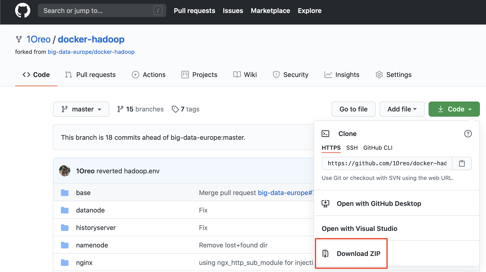
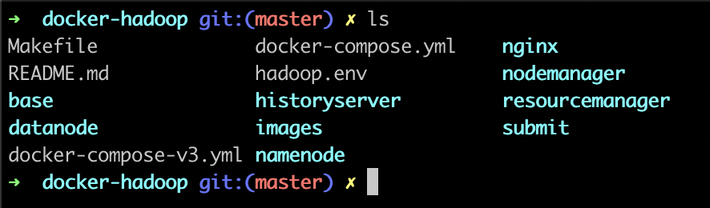
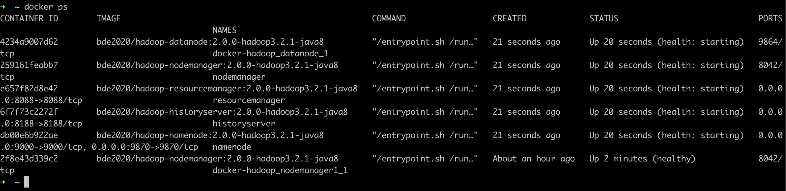
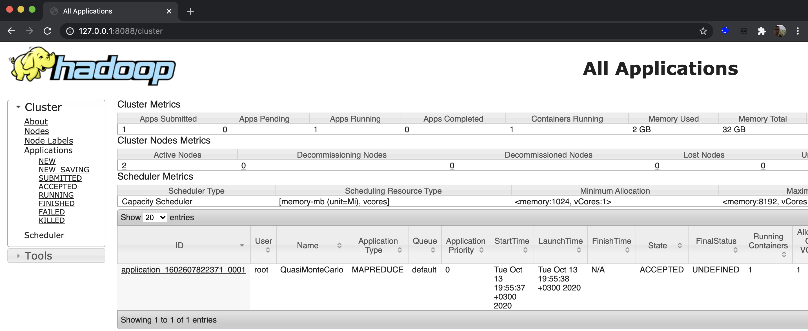
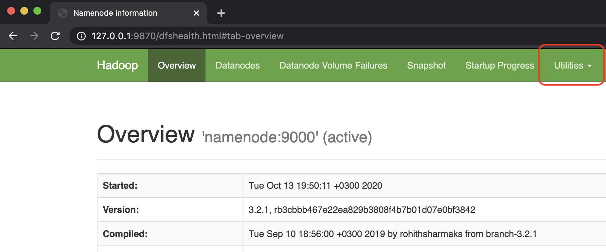
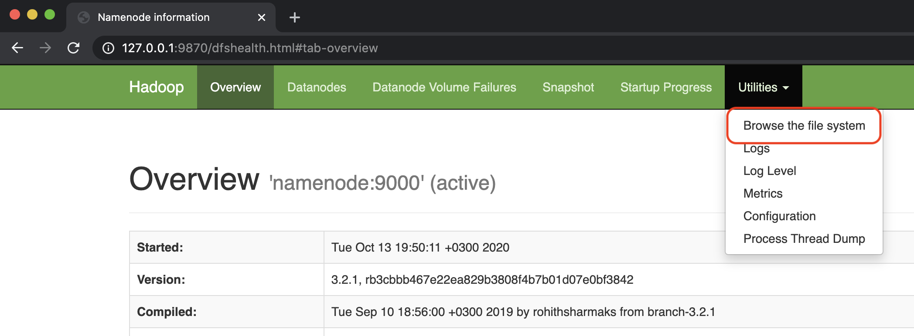
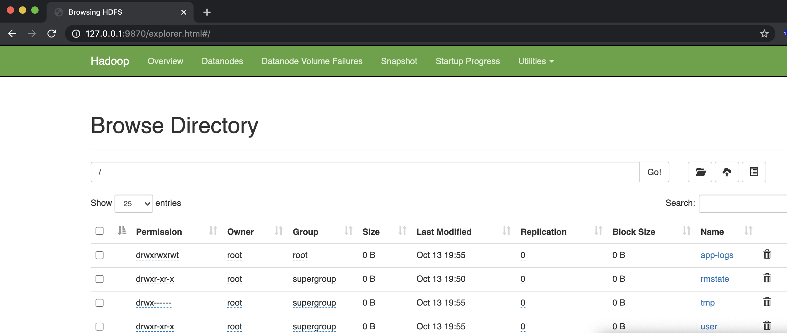
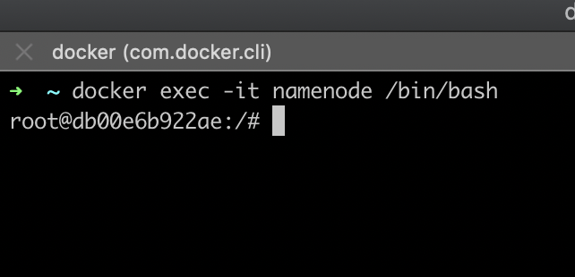
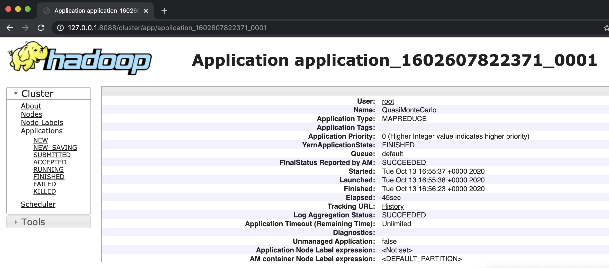

This repository is based on big-data-europe's docker-hadoop repository.

# Purpose

The purpose of this project is to allow HIT students to run a hadoop cluster on their local machines.

# Hadoop on Docker

This repository allows users to deploy apache hadoop 3.2.1 on docker using docker-compose.

# Perquisites

## Cloning this repository

The initial thing is to clone this repository. This can be done in several ways:

### Download a zip file

### Git clone

For more advanced users, using the Git CLI tool, and the Git clone command. Paste this command to your CLI in the desired location:

`git clone https://github.com/1Oreo/docker-hadoop.git`

## Installing Docker for Desktop

In order to deploy the cluster, Docker is needed, both for running Docker containers, and to deploy docker containers using Docker Compose.  
Download the installation using the following link:  
[Docker for Desktop](https://www.docker.com/products/docker-desktop)

# Deploy the cluster

Once all the prerequisites are met, we can deploy the cluster on to our Docker. Make sure Docker is up and running (after initializing) before trying to deploy the cluster.

1. Open your CLI (CMD/Powershell on windows, terminal on MacOS/Linux)
2. Change into cloned repository directory
3.   
4. Run the ofllowing command `docker-compose up`
5. Open a second terminal windows and verify the containers are running using the following command `docker ps`
6. You should see 5 containers running as follows:
7. 

# Accessing the WEB UIs

Many of the services on Hadoop have a WEB based user interface. When the containers are running appropriately, they can be accessed using a browser pointing to 12.0.0.1 with the appropriate port.

## Accessing History Server

The history server collects the data on Hadoop jobs and shows them in one place. Data such as run time and job name can be viewed using it. Accessing it is being done using port 8088 as follows:  
[http://127.0.0.1:8088](http://127.0.0.1:8088)  
The UI looks as follows:  
  

## Accessing HDFS WEB UI

It is possible to manage the HDFS using a web console, using port 9870. Use the following link:  
[http://127.0.0.1:9870](http://127.0.0.1:9870)  
This console provides data on the Hadoop cluster, and has a "Utilities" in order to interact with the hdfs file system (deleteing folders, for example).  
  
  
  

# Connecting to containers using shell

Many tasks require running CLI commands on the containers (its the equivalent of SSH into a server). It can be done using `docker exec` command to any running container, which appears on `docker ps`:  
  
For example, connecting to the namenode using docker exec can be done with the following command:  
`docker exec -it namenode /bin/bash`  
  
With the shell open, you can send any command just like logging in to a server using SSH, and use it in order to run hadoop jobs.  

# Prebuilt apps location on namenode filesystem

Hadoop comes with some default prebuilt applications, within a single JAR file. The path to this file (while connected to the namenode using shell).  
`cd opt/hadoop-3.2.1/share/hadoop/mapreduce/`  
This folder contains a file called "hadoop-mapreduce-examples-3.2.1.jar", which contains apps like PI, wordcount and terasort.  

## Running an example PI

While connected using shell and performing cd to the folder, use the following command:  
`hadoop jar hadoop-mapreduce-examples-3.2.1.jar pi 16 1000`  
This command will trigger a PI calculation using Monte Carlo and you will be able to see the job on the history server UI:  
  
Using the UI you can see the status of the the job, details such as compute time etc'.  
  